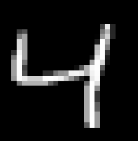

# Hello-World-to-Deep-Learning
This is my first model in Deep Learning.

In this model, firstly I trained my model with MNIST Handwritten dataset and then I tried to input my images that I draw with Paint.

And these are some examples from train dataset:

  
  
  

At 16th cell I wrote a function that takes images that I drew with Paint from directory and prepares it for model to predict.
And at 17th cell you can see the results of model on custom images. The images I drew: 

  
  
  

You can also download images (I uploaded directory with drawings).

At 18th cell you can see the result. 33% accuracy is bad. And it seems like overfitting.
